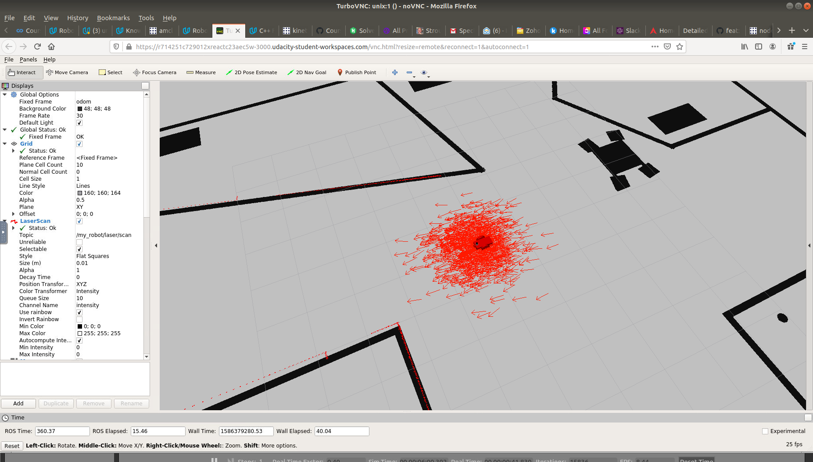
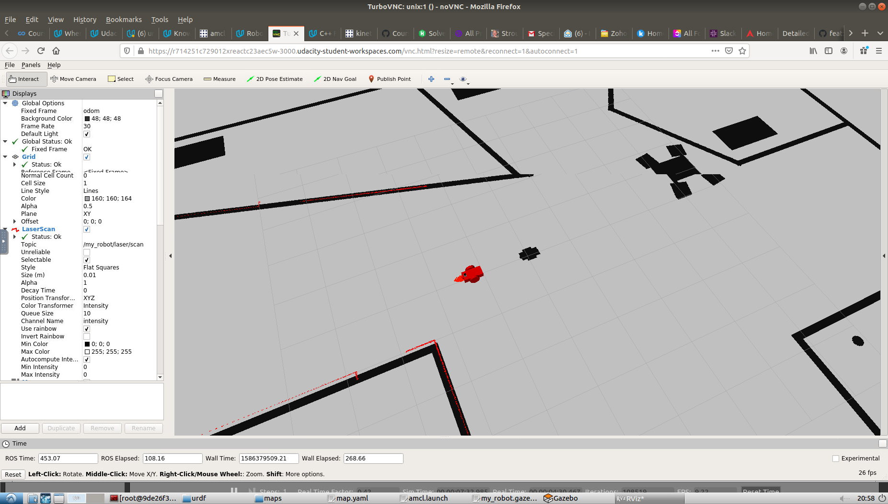

# Where_am_I_1
Using ROS AMCL package to accurately localize a mobile robot inside a map in the Gazebo simulation environment. This project is tested on ROS kinetic

Robot with particles associated with AMCL filter before navigation:


Robot with particles associated with AMCL filter after navigation:


## Introduction
This project is a part of Udacity's Robotics Software Engineering Nanodegree program. This is a basic template for localization using AMCL and can be used with readily available robots such as Kuka bot, etc

## Project Aim :
1)  Create a ROS package that launches a custom robot model in a custom Gazebo world.

2)  Utilize the ROS AMCL package and the Tele-Operation / Navigation Stack to localize the robot.

3)  Explore, add, and tune specific parameters corresponding to each package to achieve the best possible localization results.

## Instructions
To view this project, you must have ROS and Gazebo installed

Gazebo - http://gazebosim.org

ROS - http://wiki.ros.org/ROS/Installation

After installing the above, there are some ROS packages to be installed for executing this program

```
$ sudo apt-get update && sudo apt-get upgrade -y
$ sudo apt-get install ros-kinetic-navigation ros-kinetic-map-server ros-kinetic-move-base ros-kinetic-amcl
```
Optional
```
$ sudo apt-get install libignition-math2-dev protobuf-compiler 
```

Create a new folder, say where_am_i_1 and clone this repository with ``` git clone https://github.com/sourabhmisal/Where_am_I_1.git ``` in the folder

Go to the folder ` where_am_i_1 ` and execute these steps

```
$ catkin_make
$ source devel/setup.bash
$ roslaunch my_robot world.launch
```

This will initialize and run all the nodes. In Rviz, you see a red robot on a black and white map, surrounded by red arrows representing the particles associated with the AMCL filter.

There are two methods to control the robot:

1)   2D Nav Goal : 

     Click the 2D Nav Goal button in the toolbar, then click and drag on the map to send the goal to the robot. It will start moving and localize itself in the process. If you would like to give amcl node a nudge, you could give the robot an initial position estimate on the map using 2D Pose Estimate..

2)   Teleop node : 
     
     Make sure that teleop_twist_keyboard package is in your ` where_am_i_1/src ` directory.
     Repo : ` https://github.com/ros-teleop/teleop_twist_keyboard `
     
     To operate the robot via the keyboard, open a second terminal, go to the ` where_am_i_1 ` directory, and execute:
     ```
     $ source devel/setup.bash
     $ rosrun teleop_twist_keyboard teleop_twist_keyboard.py
     
     ```
     You can then command the robot to move using the keys indicated by the teleop node in the command prompt.

